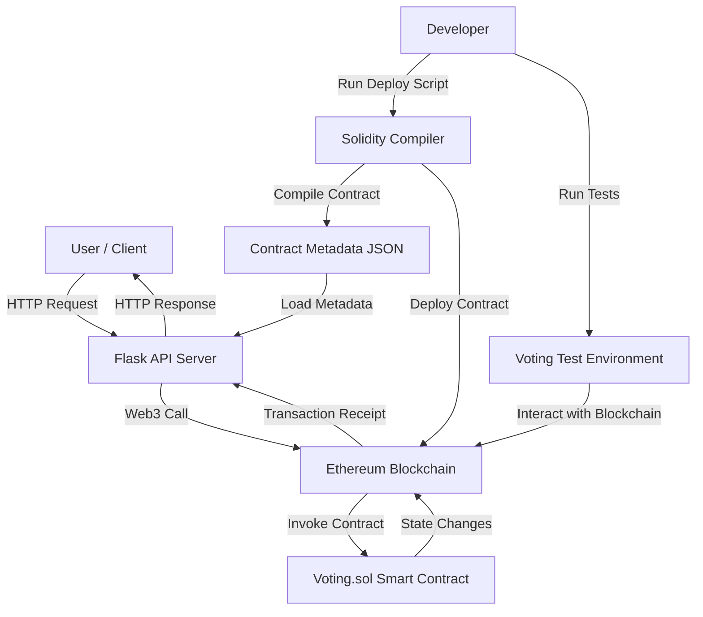

# Blockchain Voting Application

## Secure, Transparent, and Decentralized Vote Tracking

This project presents a robust and transparent decentralized voting application built on the Ethereum blockchain. Leveraging smart contract technology, it ensures the immutability and verifiability of every vote, addressing critical challenges in traditional voting systems. The application provides a user-friendly interface through a RESTful API, abstracting the complexities of blockchain interaction.


## Features

*   **Decentralized & Immutable Voting:** All voting records are securely stored on an Ethereum-compatible blockchain, guaranteeing transparency, resistance to tampering, and permanent record-keeping.
*   **Smart Contract Powered Logic:** A meticulously designed Solidity smart contract (`Voting.sol`) governs the entire voting process, from candidate registration and vote casting to secure tallying and result retrieval. This ensures that voting rules are enforced programmatically and transparently.
*   **Intuitive RESTful API:** A Flask-based API provides a seamless interface for users and external applications to interact with the blockchain. It simplifies operations like casting votes and querying results, eliminating the need for direct blockchain knowledge.
*   **Comprehensive Automated Testing:** A dedicated `pytest` suite rigorously tests the smart contract's logic and its integration with the backend, ensuring high reliability, correctness, and security of the voting process.
*   **Local Development Environment:** Easy setup with `ganache-cli` for a personal blockchain and `web3.py` for Python-blockchain interaction, facilitating rapid development and testing.

## Technology Stack

*   **Blockchain Platform:** Ethereum
*   **Smart Contract Language:** Solidity
*   **Backend Framework:** Python, Flask
*   **Blockchain Interaction Library:** Web3.py
*   **Local Blockchain:** Ganache
*   **Solidity Compiler:** `solc-x` (Python wrapper for `solc`)
*   **Testing Framework:** `pytest`

## Getting Started

This section guides you through setting up and running the Blockchain Voting Application on your local machine.

### Prerequisites

Ensure you have the following installed:

*   **Python 3.8+**: Download from [python.org](https://www.python.org/).
*   **pip**: Python package installer (usually comes with Python).
*   **Node.js & npm**: Required for Ganache. Download from [nodejs.org](https://nodejs.org/).
*   **Ganache**: A personal Ethereum blockchain for local development. Install globally via npm:
    ```bash
    npm install -g ganache-cli
    ```
*   **Solidity Compiler (`solc`)**: The `deploy.py` script will attempt to install `solc` for you. For manual installation (e.g., if automatic fails), refer to the [official Solidity installation guide](https://docs.soliditylang.org/en/latest/installing-solidity.html).

### Installation

1.  **Clone the repository:**
    ```bash
    git clone <repository-url>
    cd blockchainvoting
    ```

2.  **Install Python dependencies:**
    ```bash
    pip install -r requirements.txt
    ```

### Running the Application

Follow these steps in separate terminal windows for a complete local setup:

1.  **Start Ganache:**
    Open a new terminal and run:
    ```bash
    ganache-cli
    ```
    This will start a local Ethereum blockchain instance. Keep this terminal open. Note the accounts and private keys displayed; you'll need a private key for the `.env` file.

2.  **Deploy the Smart Contract:**
    In another terminal, run the deployment script. This compiles `Voting.sol`, deploys it to Ganache, and generates `contract_meta.json` (needed by the API).
    ```bash
    python3 deploy.py
    ```
    Take note of the candidate addresses printed in the output.

3.  **Run the Flask API:**
    In a third terminal, start the Flask application:
    ```bash
    python3 app.py
    ```
    The API server will be accessible at `http://127.0.0.1:5001`. You can view the interactive API documentation (Swagger UI) by navigating to `http://localhost:5001/apidocs` in your web browser.

## How It Works

The Blockchain Voting Application operates in three main layers:

1.  **Blockchain Layer (Smart Contract):** The `Voting.sol` smart contract, deployed on Ethereum, is the core of the system. It defines the rules for candidate registration, vote casting, and result tallying. All votes are recorded as transactions on the blockchain, ensuring their immutability and transparency.

2.  **Backend Layer (Flask API):** The `app.py` Flask application acts as an intermediary. It exposes a RESTful API that allows users to interact with the smart contract without direct blockchain knowledge. When a user casts a vote via the API, the Flask application constructs and sends a transaction to the smart contract. Similarly, when results are requested, the API queries the smart contract and returns the data.

3.  **Development & Testing Layer:** Scripts like `deploy.py` handle the compilation and deployment of the smart contract. The `test/` directory contains `pytest` unit tests that simulate voting scenarios, ensuring the smart contract behaves as expected under various conditions.

## Project Structure

```
/
├── core/               # Core application logic
│   ├── contract/       # Solidity smart contract definitions
│   └── control/        # Python scripts for blockchain interaction and control
├── cred/               # Compiled contract artifacts (ABI, bytecode) and credentials
├── docs/               # Comprehensive project documentation (architecture, requirements, usage)
├── test/               # Pytest unit and integration tests
├── app.py              # Main Flask API application
├── deploy.py           # Script for compiling and deploying the smart contract
├── requirements.txt    # Python dependency list
├── contract_meta.json  # Generated after deployment, contains contract address and ABI
├── .env                # Environment variables (e.g., RPC_URL, PRIVATE_KEY)
└── README.md           # This file
```

## Future Enhancements

*   **User Interface (Frontend):** Develop a web-based or mobile frontend to provide a more intuitive user experience for casting votes and viewing results.
*   **Event Listening:** Implement real-time listening for smart contract events (e.g., `VoteCast` event) to update frontend dashboards dynamically.
*   **Advanced Voting Mechanisms:** Explore more complex voting systems like quadratic voting or ranked-choice voting.
*   **Security Audits:** Conduct formal security audits of the smart contract to identify and mitigate potential vulnerabilities.
*   **Deployment to Testnet/Mainnet:** Provide instructions and considerations for deploying the application to public Ethereum testnets (e.g., Sepolia, Goerli) or the Ethereum mainnet.

## License

This project is open-sourced under the MIT License. See the `LICENSE` file for more details.
