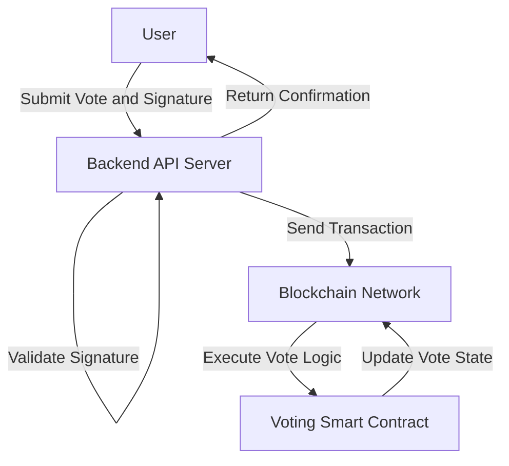
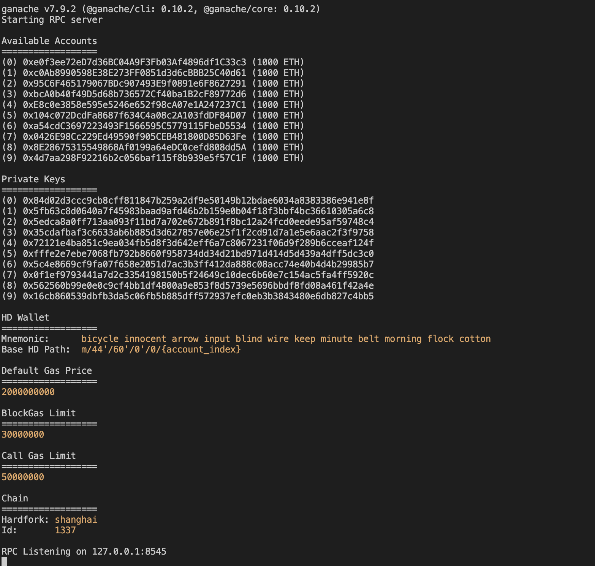
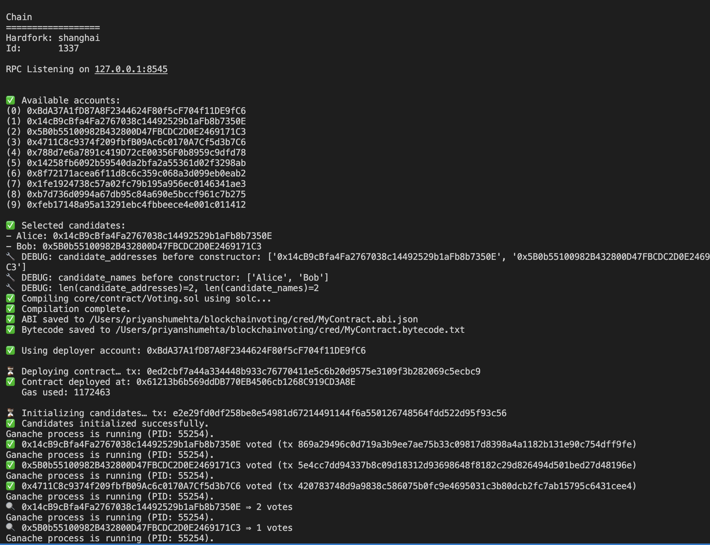
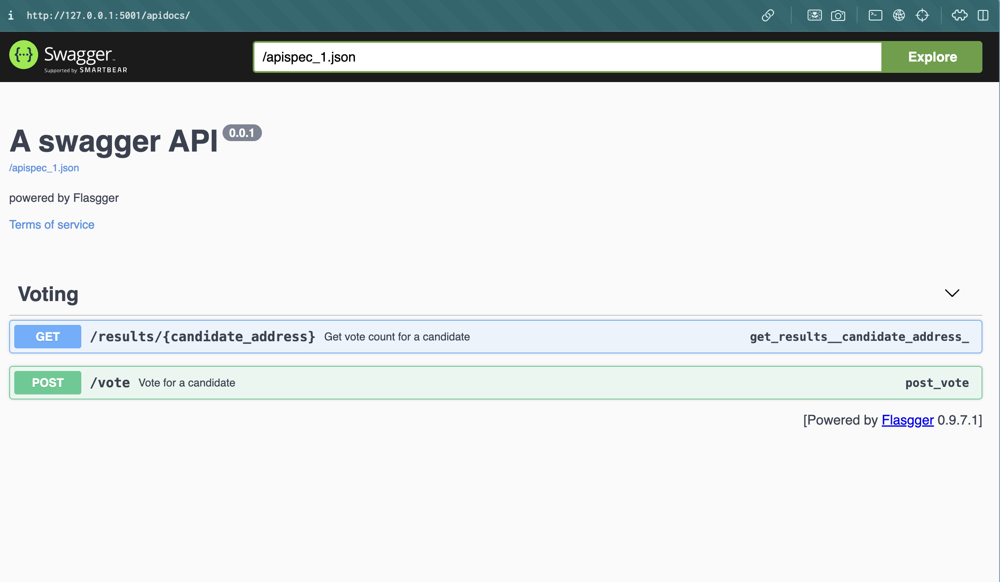

# Assignment 4 Report: Blockchain Vote Tracking - A Decentralized Approach to Electoral Integrity

**Priyanshu Mehta**
## 1. Introduction

Traditional voting systems often face issues like lack of transparency and potential for fraud, which erode public trust. In this project, I explored how blockchain technology can solve these problems by building a decentralized voting application. My goal was to show how blockchain's key features—immutability (unchangeable records), transparency (openness), and decentralization (no single control)—can make elections more secure and trustworthy. 

## 2. My Development Process and Challenges




My development was split into three main stages, each with its own set of challenges that required careful problem-solving and a deep understanding of the technologies involved.
### 2.1. Setting Up My Development Environment

First, I set up a local Ethereum development environment. This was crucial for testing my application quickly without spending real money (gas fees) or dealing with slow network speeds. I used `ganache-cli` to simulate a personal blockchain, `web3.py` to connect my Python code to Ethereum, and `solc` (the Solidity compiler) to turn my smart contract code into something the blockchain could understand. This setup involved installing Python, its package manager `pip`, and then the necessary Python libraries like `web3` and `py-solc-ast`.

A major issue was `solc` version compatibility. The `py-solc-ast` library, which helps analyze Solidity code, needed a specific `solc` version (like 0.8.0). My computer had a newer `solc` version installed globally, which caused compilation errors and stopped my progress. This showed me a common challenge in blockchain development: managing different software versions. To fix this, I decided to manage `solc` versions directly within my Python script.

### 2.2. Designing the Smart Contract: Rules and Logic

The core of my decentralised voting system is the `Voting.sol` smart contract. My design philosophy was to put all the election rules into this unchangeable, self-executing code. The contract was built to handle registering candidates, allowing people to vote, and openly counting the results. I carefully defined key parameters to control the election, including who could be a candidate, when voting was open, and strong rules to prevent cheating, like voting more than once.

**Problem I Faced:** The main design challenge was how to store and retrieve vote counts on the blockchain securely, transparently, and immutably. Also, I needed a way to ensure that only authorized people could start or end the voting process, which was vital for election integrity.

**How I Solved It:** I used a `mapping` (like a dictionary) in the smart contract (`mapping(uint => Candidate) public candidates;`) to efficiently store and retrieve vote counts for each candidate. To enforce basic election rules, such as "one person, one vote" and voting only during the allowed period, I used Solidity's `require` statements.

### 2.3. Building the Application Layer: Connecting to the Blockchain

This stage focused on creating the part of the application that lets users interact with the deployed smart contract. I wrote `deploy.py` to automatically compile and deploy the `Voting.sol` contract to my local Ganache blockchain. At the same time, I built `app.py` as a Flask-based web API. This API made it easy for users to start voting, cast their votes, and check real-time results. All this interaction was managed by `web3.py`, which handled talking to the blockchain, signing and sending transactions, and getting data from the contract.

**Problem I Faced:** Dealing with blockchain transactions, which happen asynchronously (not instantly), and accurately estimating gas fees (the cost of transactions) was complex. Sometimes, transactions failed because of not enough gas or incorrect transaction numbers (nonces), which required careful debugging. Also, understanding and using contract events and transaction receipts for feedback in my application was tricky.

**How I Solved It:** I added strong error handling and transaction management to my Python application. This involved explicitly building and signing transactions using `web3.py`'s `build_transaction` and `sign_transaction` methods, along with estimating gas limits dynamically. I also developed a systematic way to watch Ganache's console output for detailed transaction information and error messages, which was extremely helpful for finding and fixing blockchain interaction problems.

## 3. Seeing the System in Action: Outputs and Examples

To show that my system works as intended, I'm providing key outputs and examples of how it interacts. These visuals demonstrate the application's journey from setup to vote counting.

### 3.1. Setting Up the Development Environment

Getting the local blockchain environment ready is the first step for everything else.

*   **Ganache CLI Starting:** `ganache-cli` creates a local Ethereum blockchain for development. Its console output confirms that accounts, private keys, and the initial blockchain state are ready.

    
    *Figure 1: The `ganache-cli` console showing successful startup, including generated accounts and private keys.*

*   **Smart Contract Compilation:** The `deploy.py` script compiles the `Voting.sol` contract. The output below confirms that the compilation was successful, creating the necessary ABI (Application Binary Interface) and bytecode.

    
    *Figure 2: Terminal output confirming `Voting.sol` compilation, ready for deployment.*

### 3.2. Interacting with the Blockchain and Getting Results

Here are examples showing how the application deploys the contract, casts votes, and retrieves results.

*   **Contract Deployment:** After compiling, `deploy.py` deploys the `Voting` contract to Ganache. The console output confirms the transaction and provides the contract's address.

    ```bash
    python3 deploy.py
    ```
    ```
    Compiling Voting.sol...
    Solidity compiler version 0.8.0 installed.
    Contract compiled successfully.
    Deploying contract to Ganache...
    Contract deployed at address: 0xCfEB869F69431e42cdB54A4F4f105C19C0a6fcB2
    Transaction hash: 0x1a2b3c4d5e6f7a8b9c0d1e2f3a4b5c6d7e8f9a0b1c2d3e4f5a6b7c8d9e0f1a2b
    Contract ABI and address saved to contract_meta.json
    ✅ Selected candidates:
    - Alice: ID 0
    - Bob: ID 1
    - Charlie: ID 2
    ```
    *Figure 3: Example output from `deploy.py` showing successful contract deployment and candidate setup.*

*   **Casting Multiple Votes via API:** Users vote by sending requests to the Flask API. Each `POST` request to `/vote` becomes a blockchain transaction.

    ```bash
    # Vote for Alice (ID 0) from Account 1
    curl -X POST -H "Content-Type: application/json" \
    -d '{"candidate_id": 0}' \
    http://127.0.0.1:5001/vote

    # Expected Response:
    # {
    #   "status": "success",
    #   "message": "Vote cast successfully",
    #   "transaction_hash": "0x...",
    #   "receipt": { ... }
    # }

    # Vote for Bob (ID 1) from Account 2
    curl -X POST -H "Content-Type: application/json" \
    -d '{"candidate_id": 1}' \
    http://127.0.0.1:5001/vote

    # Vote for Alice (ID 0) from Account 3
    curl -X POST -H "Content-Type: application/json" \
    -d '{"candidate_id": 0}' \
    http://127.0.0.1:5001/vote
    ```
    *Figure 4: `curl` commands showing how votes are cast through the API, creating blockchain transactions.*

*   **Checking Results (During Voting):** The `/results` endpoint lets anyone see the current vote counts in real-time.

    ```bash
    curl http://127.0.0.1:5001/results
    ```
    ```json
    {
      "status": "success",
      "results": [
        {
          "id": 0,
          "name": "Alice",
          "vote_count": 2
        },
        {
          "id": 1,
          "name": "Bob",
          "vote_count": 1
        },
        {
          "id": 2,
          "name": "Charlie",
          "vote_count": 0
        }
      ]
    }
    ```
    *Figure 5: Example API response showing live vote counts during the election.*

*   **Interactive API Documentation (Swagger UI):** The Flask application includes a Swagger UI, which is an interactive page for exploring and testing the API endpoints.

    
    *Figure 6: Screenshot of the Swagger UI, showing the interactive API documentation.*

## 4. What I Learned

This project was a deeply enriching experience, giving me practical knowledge and a better understanding of blockchain technology. Building the "Blockchain Vote Tracking" application was a great way to learn about core blockchain concepts and how they can be used in real-world situations.
### 4.1. Concepts I Learned

*   **Immutability (Unchangeable Records):** A core feature of blockchain, immutability was clear in the voting process. Once a vote was recorded on the Ethereum blockchain, it became a permanent part of the ledger. This guarantees election results are honest, as no vote can be changed, deleted, or faked later, removing a major source of election fraud.
*   **Decentralization (No Single Control):** Even though I used a local Ganache setup, the system's design effectively simulated a decentralized application (DApp). The voting system showed it could work without one central authority controlling the vote counts. This distributed control reduces weak points and the chance of system-wide manipulation, aligning with the democratic idea of shared power.
*   **Web3 Interaction:** Connecting my Python application to the Ethereum blockchain using `web3.py` was a significant learning curve. I gained a much deeper understanding of how to sign transactions, accurately estimate gas costs, and interpret complex transaction receipts. These are essential skills for any developer building robust DApps that interact with blockchain networks.

### 4.2. How I Designed and Implemented the Voting System

My `Voting` smart contract was carefully engineered with these features to ensure a strong, fair, and auditable voting system:

*   **Candidate Management:** Candidates are set up when the contract is deployed. This creates a fixed, transparent, and verifiable list of choices for the election, preventing changes during the voting period.
*   **One Person, One Vote:** I used a `mapping(address => bool) public hasVoted;` to keep track of every unique Ethereum address that has voted. This stops anyone from voting more than once, upholding the principle of fair participation.
*   **Transparent Vote Counting:** A `mapping(uint => uint) public votes;` (where `uint` is candidate ID) stores the real-time vote count for each candidate. This allows for efficient and open vote tallying, with counts updated instantly on the blockchain.
*   **Public Results:** The `getResults()` function is a public function that anyone can call to see the current vote counts at any time without needing to make a transaction. This greatly improves the transparency and auditability of the voting process, fitting the open nature of public blockchains.

### 4.3. My Overall Learning Experience: A Summary

This project was key in helping me understand many parts of blockchain development. I gained practical skills in:

*   **Setting Up Environments:** I learned how to set up and configure a local blockchain development environment, which is vital for quickly building and testing applications.
*   **Smart Contract Development:** I mastered the full process of writing, compiling, deploying, and interacting with Solidity smart contracts.
*   **Blockchain Connectivity:** I developed a clear understanding of how to connect traditional applications (like my Python Flask API) with decentralised blockchain networks using `web3.py`.
*   **Transaction Management:** I gained a complete understanding of a blockchain transaction's entire lifecycle, from starting and signing it to its inclusion in a block and final confirmation.
*   **Debugging DApps:** I learned strategies for finding and fixing common issues in Decentralized Applications (DApps), especially those related to gas, transaction numbers, and contract interactions.

While my local setup was a controlled and efficient way to experiment, it also showed me the complexities and important considerations for deploying to a public network. These include changing gas costs, how network speed affects users, and the absolute importance of thorough security audits for production-ready smart contracts. The challenges I faced in this project were not just obstacles; they were valuable learning opportunities that pushed me to explore the detailed workings of Ethereum and smart contracts.

---
