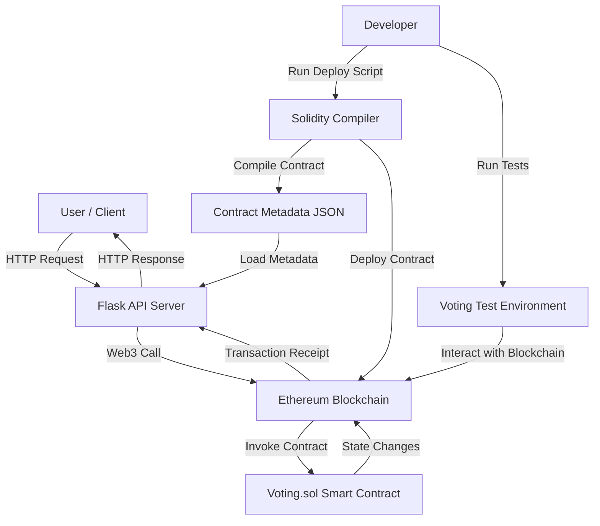

# System Architecture

This document outlines the comprehensive system architecture of the Blockchain Voting Application, detailing its core components, their interconnections, and the flow of data.

## 1. Overview

The application is designed with a layered architecture to ensure modularity, scalability, and clear separation of concerns. It primarily consists of three main layers:

1.  **Blockchain Layer (Smart Contract):** This layer encapsulates the core voting logic and data persistence on an Ethereum-compatible blockchain.
2.  **Application Layer (API Server):** A Python Flask application serving as the primary interface, abstracting blockchain complexities from end-users.
3.  **Development & Testing Layer:** A suite of scripts and tests facilitating development, deployment, and verification of the system.

## 2. Component Breakdown

### 2.1. Blockchain Layer: Smart Contract (`Voting.sol`)

*   **Language:** Solidity
*   **Location:** `core/contract/Voting.sol`

This smart contract is the foundational component of the application, deployed directly onto the Ethereum blockchain. It programmatically enforces the rules and logic of the voting process, ensuring transparency, immutability, and resistance to manipulation.

*   **Key Functions:**
    *   `startVoting()`: An owner-only function to initiate the voting period, making the `vote()` function active.
    *   `endVoting()`: An owner-only function to conclude the voting period, preventing further votes and finalizing results.
    *   `vote(uint _candidateId)`: Allows any eligible voter (Ethereum address) to cast a single vote for a specified candidate. Includes checks to prevent double-voting and ensure voting occurs within the active period.
    *   `getResults()`: A public `view` function that returns the current vote counts for all candidates. This function does not modify the blockchain state.

*   **State Variables:**
    *   `owner (address)`: Stores the address of the contract deployer, granting administrative privileges.
    *   `votingStarted (bool)`: Flag indicating if the voting period has begun.
    *   `votingEnded (bool)`: Flag indicating if the voting period has concluded.
    *   `totalCandidates (uint)`: The total number of registered candidates.
    *   `candidates (mapping(uint => Candidate))`: A mapping where each `uint` (candidate ID) points to a `Candidate` struct, storing their name and vote count.
    *   `hasVoted (mapping(address => bool))`: A mapping to track which Ethereum addresses have already cast their vote, enforcing the one-person-one-vote rule.

### 2.2. Application Layer: API Server (`app.py`)

*   **Framework:** Flask
*   **Location:** `app.py`

This Python-based Flask server acts as the intermediary between external clients (e.g., web browsers, `curl` commands) and the blockchain. It exposes a RESTful API, abstracting the complexities of direct blockchain interaction from the end-user.

*   **Endpoints:**
    *   `POST /vote`: Accepts a JSON payload containing the candidate ID. It then constructs and sends a transaction to the `vote()` function of the deployed smart contract on behalf of the user.
    *   `GET /results`: Queries the `getResults()` view function of the smart contract and returns the current vote counts for all candidates in a JSON format.

*   **Interaction with Blockchain:** The API leverages the `Web3.py` library to establish a connection with the Ethereum network (e.g., Ganache). It reads the deployed contract's address and Application Binary Interface (ABI) from the `contract_meta.json` file, enabling it to correctly encode function calls and decode responses.

### 2.3. Development & Testing Layer: Control and Deployment Scripts (`core/control/`)

This directory houses Python scripts crucial for the development lifecycle, including contract management and testing.

*   **`deploy.py` (Root Directory):** This standalone script is responsible for:
    1.  Compiling the `Voting.sol` smart contract using `solc-x`.
    2.  Deploying the compiled bytecode to the configured Ethereum network (e.g., Ganache).
    3.  Saving the deployed contract's address and ABI into `contract_meta.json` for the API server to use.

*   **`voting.py`:** Defines the `VotingTestEnvironment` class, which orchestrates the setup of an isolated testing environment. This includes starting a local Ganache instance, compiling and deploying the smart contract, and initializing candidates for testing purposes.

*   **`service.py`:** Defines the `VoteService` class, which provides an abstraction layer for the Flask API. It encapsulates the logic for interacting with the deployed smart contract, making API endpoint implementations cleaner and more maintainable.

*   **`compiler.py`:** A utility module for programmatically interacting with the Solidity compiler (`solc-x`), handling compilation of `.sol` files into bytecode and ABI.

### 2.4. Testing (`test/`)

*   **Framework:** `pytest`
*   **Location:** `test/test_voting_scenarios.py`

The test suite provides comprehensive, automated testing for the smart contract's logic and its integration with the Python backend. It utilizes the `VotingTestEnvironment` to create fresh, isolated blockchain states for each test run, ensuring reliability and repeatability of tests.

## 3. Data Flow and Interaction Diagram

This diagram illustrates the primary data flow and interactions between the different components of the Blockchain Voting Application.

**Explanation of Data Flow:**

1.  **User Interaction:** Users or client applications initiate requests (e.g., to cast a vote or retrieve results) via HTTP to the Flask API Server.
2.  **API Processing:** The Flask API Server receives these requests. For voting, it uses `Web3.py` to construct and sign a blockchain transaction that calls the `vote()` function on the `Voting.sol` smart contract. For results, it calls the `getResults()` view function.
3.  **Blockchain Interaction:** `Web3.py` sends the transaction or call to the Ethereum Blockchain (e.g., a local Ganache instance). The blockchain processes the transaction, executes the smart contract logic, and updates its state.
4.  **Smart Contract Execution:** The `Voting.sol` smart contract processes the incoming calls/transactions, applies its defined logic (e.g., validating a vote, updating vote counts), and potentially emits events.
5.  **Response Back to User:** The blockchain returns a transaction receipt (for transactions) or data (for view calls) to the Flask API. The API then formats this information and sends an appropriate HTTP response back to the user.
6.  **Development Workflow:** During development, `deploy.py` compiles the Solidity contract and deploys it to the blockchain, generating `contract_meta.json` which contains the contract's address and ABI. This `contract_meta.json` is then used by the Flask API to know how to interact with the deployed contract. `pytest` tests, utilizing `VotingTestEnvironment`, interact with the blockchain to verify smart contract behavior.